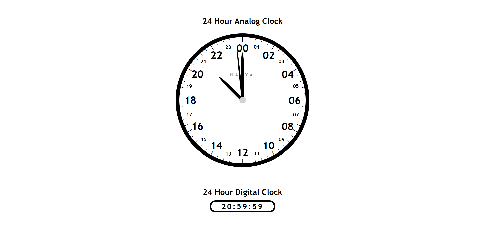

# 24-Hour Analog \& Digital Clock

This project is a hands-on study to deepen my understanding of JavaScript. The goal was to create both an analog and digital clock that displays time in a 24-hour format. The project started from a tutorial I followed (Video Reference: [Link](https://www.youtube.com/watch?v=NlAw_kd2608) ) to understand the clock's functionality, but I expanded upon it by adding a digital clock, making the design responsive, and personalizing it with my own branding.

## Technology Used

* HTML
* CSS
* JavaScript

## Live Demo

[24-Hour Analog \& Digital Clock - Live Demo](https://project-24hr-analog-digital-clock.netlify.app/)

## Screenshot

## Features

* 24-Hour Analog Clock: A classic analog clock showing time in the 24-hour format.
* 24-Hour Digital Clock: Displays the time in a 24-hour digital format.
* Responsive Design: The layout adjusts seamlessly for different screen sizes, ensuring the clock looks good on mobile devices as well as desktops.
* Custom Design Elements: Personal branding with my name integrated into the clock interface.

## Project Motivation

I’ve always been fascinated by 24-hour analog clocks, but I found it challenging to find one that suits my needs, whether physically or online. This project was an opportunity to create my own. Due to how challenging it can be to read the minutes on the 24-hour analog clock, I added a 24-hour digital clock as well to make reading the time easier.

